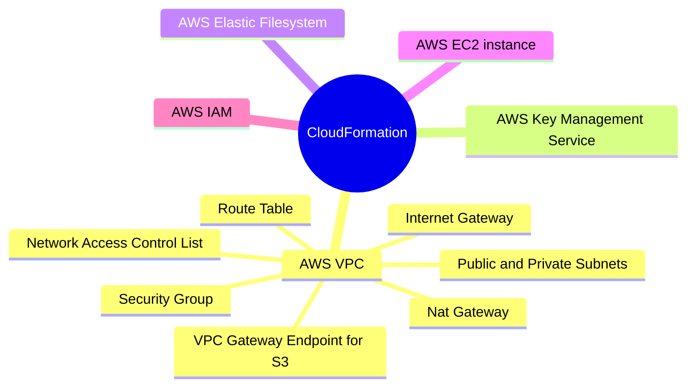

&nbsp;&nbsp;&nbsp;&nbsp;&nbsp;&nbsp;&nbsp;&nbsp;&nbsp;

# Project Allium: Mounting an Elastic File System to multiple EC2 instances.

Creating a VPC with two public and private subnets and an EFS with mount points in the two public subets. Create two public EC2 instances in the public subnets and mounting the EFS to the two EC2 instances. This demonstrate how a EFS can be used to persist from multiple EC2 instances.

## Description

A custom **VPC** is created with two public and private subnets in two different **Availabity Zones**. An **Internet Gateway** is attached to the VPC to connect to the internet. Network Access Control List is used a first line of defence to secure the subnets. One security group (EC2 security group) controls SSH access to the EC2 instances. An EFS security group with the source security group as the EC2 security group controls access to the EFS from the EC2 instances. **Nat Gateway** grants internet access to the private subnets. An EFS created in the VPC with two mount targets in the two public subnets. Two EC2 instances are created in the two public subnets and mounts the **Elastic File System**.

### Services Used

## Root stack launching the child stacks to create the necessary resources:

## Security groups :

## EC2 user data in the CloudFormation template :

## EC2 instances with EFS mounted :

## Help

:email: Subhamay Bhattacharyya - [subhamay.aws@gmail.com]

## Authors

Contributors names and contact info

Subhamay Bhattacharyya - [subhamay.aws@gmail.com]

## Version History

- 0.1
  - Initial Release

## License

This project is licensed under Subhamay Bhattacharyya. All Rights Reserved.

## Acknowledgments
